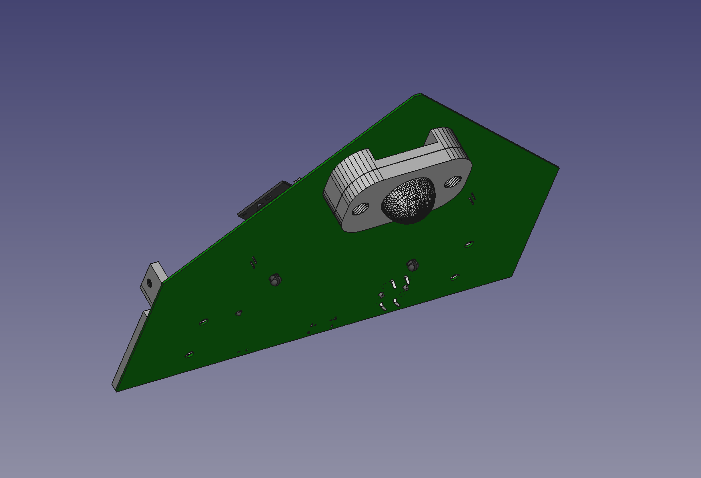
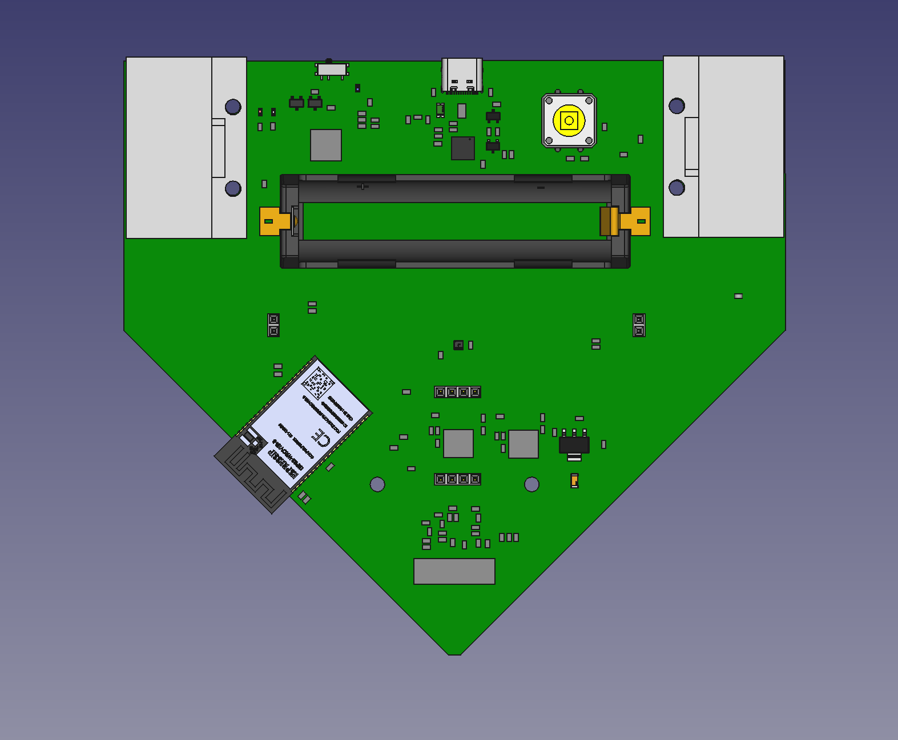
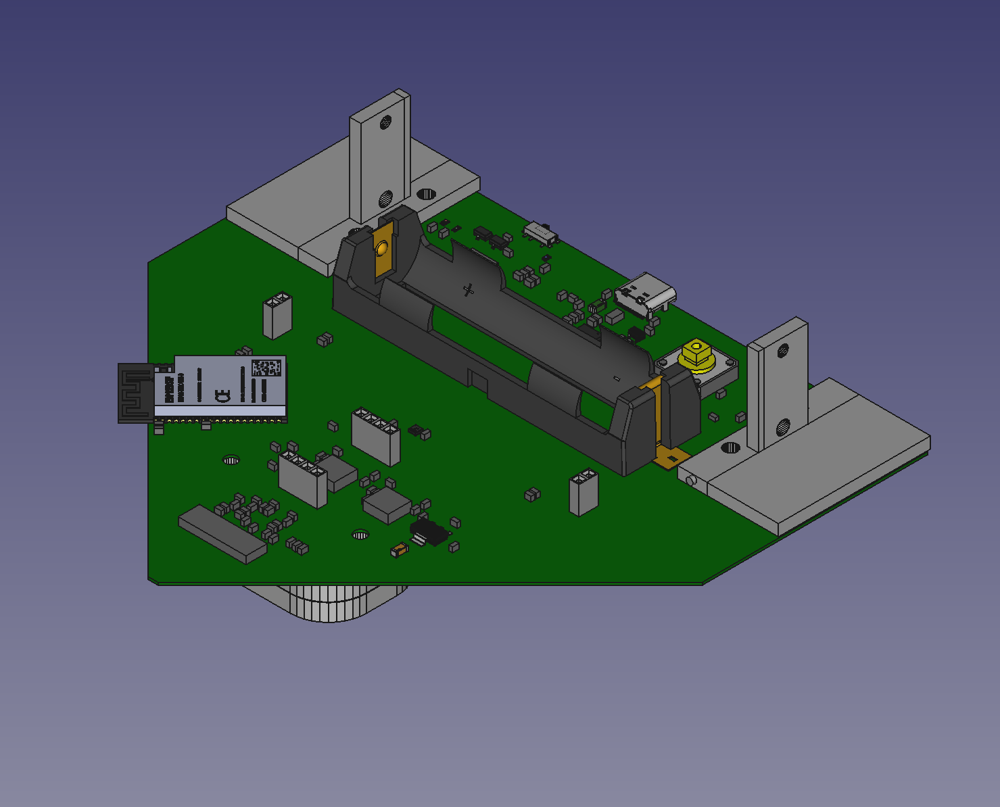
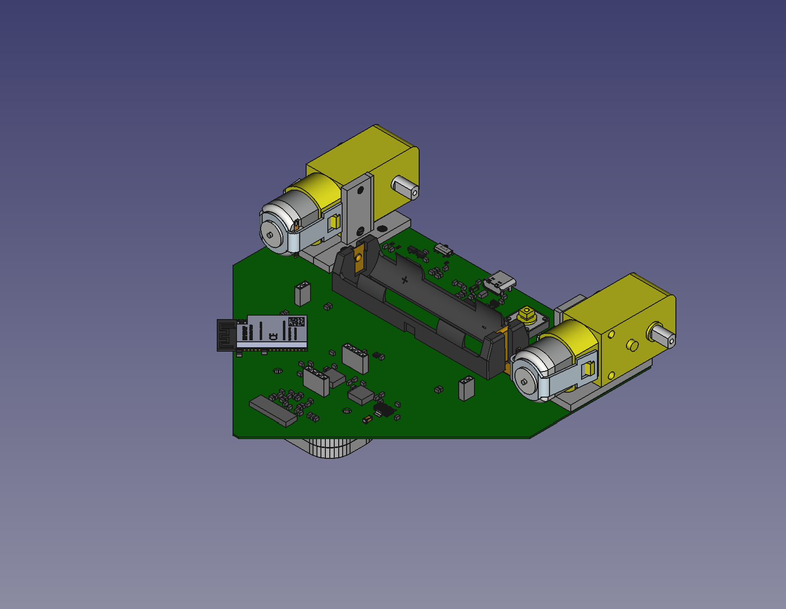
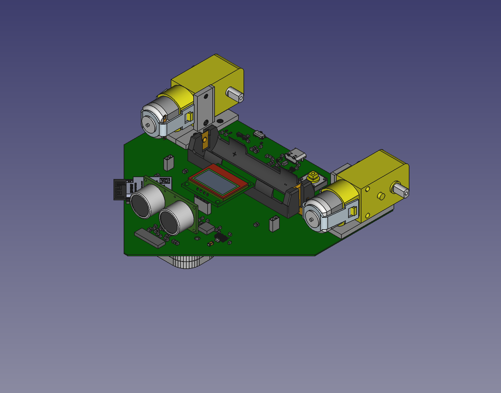
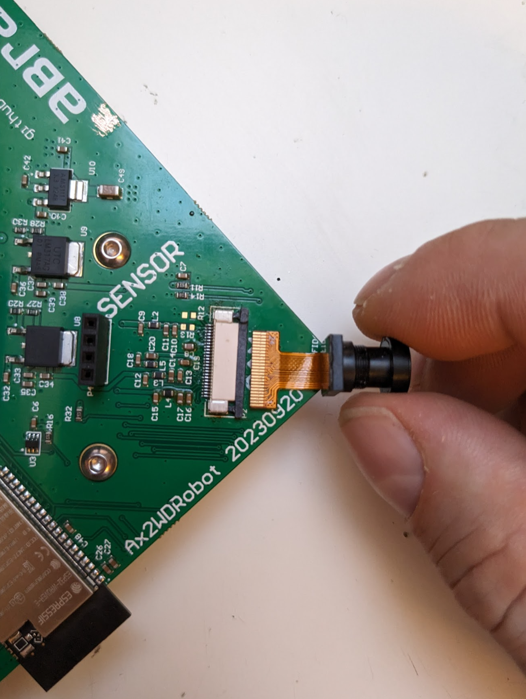
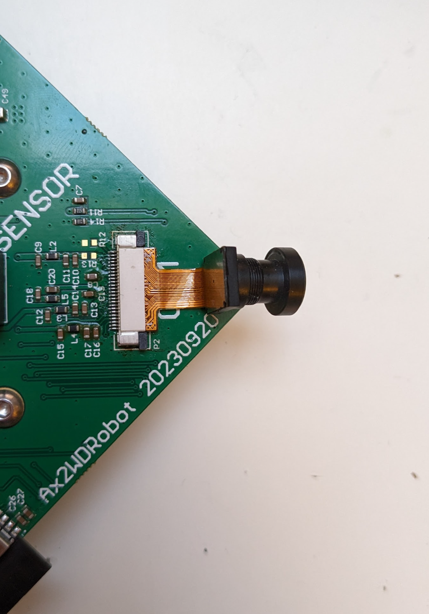
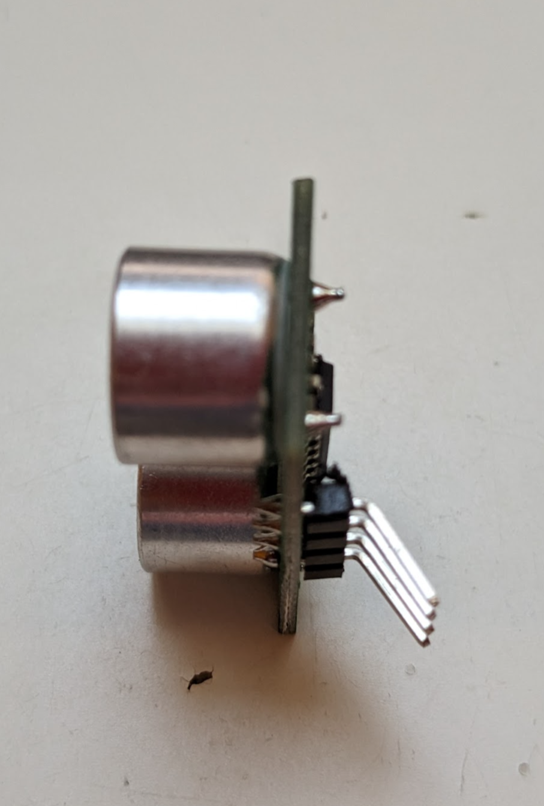

# Abrantix Ax2WDRobot Assembly instructions

## Parts

- 1x Ax2WDRobot Mainboard
- 1x 18650 Battery i.e. NCR18650B
- 1x OLED Display 0.96" SSD1306
- 1x Ultrasonic Sensor RCW-0001
- 1x Camera-Module OV2640 wide angle 120°
- 2x TT Gear motor Dual Shaft with Wheel and Dupont wires soldered on
- 1x Swivel caster roller ~45x28x14mm
- 1x Zip tie
- 4x M3 Button Head screw 10mm
- 2x M3 Button Head screw 14mm
- 4x M3 Button Head screw 25mm
- 10x M3 Nut
- 10x M3 Spring washer
- 1x roller spacer (3d printed)
- 2x motor holder (3d printed)

Optional:
- 1x USB Type A to C data/charging cable

## Assembly Step 1

### Required parts
- 1x Ax2WDRobot Mainboard
- 1x Swivel caster roller
- 1x roller spacer (3d printed)
- 2x M3 Button Head screw 14mm
- 2x M3 Nut
- 2x M3 Spring washer

### Instructions
Grab the Ax2WDRobot Mainboard and screw on the swivel caster roller and roller spacer to the bottom of the Mainboard by using two M3x14mm screws

## Assembly Step 2

### Required parts
- 2x motor holder (3d printed)
- 4x M3 Button Head screw 10mm
- 4x M3 Nut
- 4x M3 Spring washer

### Instructions
Screw on the two motor holders by using M3x10mm screws

## Assembly Step 3

### Required parts
- 2x TT Gear motor assembly
- 4x M3 Button Head screw 25mmm
- 4x M3 Nut
- 4x M3 Spring washer

### Instructions
Screw on the two motors to the holders by using M3x25mm screws

## Assembly Step 4

### Required parts
- 1x Camera-Module OV2640 wide angle 120°
- 1x OLED Display 0.96" SSD1306
- 1x Ultrasonic Sensor RCW-0001

### Instructions
Unlock the cam connector by sliding the grey locking clip to the front edge of the mainboard. 
Insert the Camera-Module into the connector by facing its contacts upside
Lock the cam connector by sliding the grey locking clip back

Slightly bend the pins of the Ultrasonic distance sensor by ~30° and insert it into the *SENSOR* connector

Insert the OLED Display into the *DISPLAY* connector

Plug in the motor connectors (red means *+*, black means *-*). Please connect them "cross-over": the left motor goes to the connector on the right side of the mainboard and vice-versa. Add a zip tie to the cables for better fixation

Finally, insert the 18650 battery into the battery compartment. **IMPORTANT: Check polarity of battery before inserting.**

## Glueing
For better fixation, it's recommended to apply a small amount of (hot) glue to the motor Dupont connectors and the cam.

Now, your Ax2WDRobot is ready to be charged and flashed.

