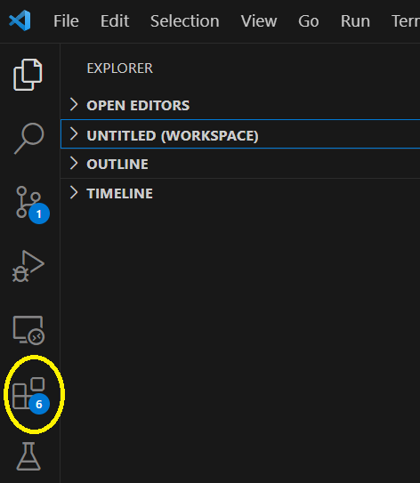
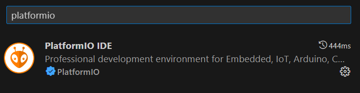
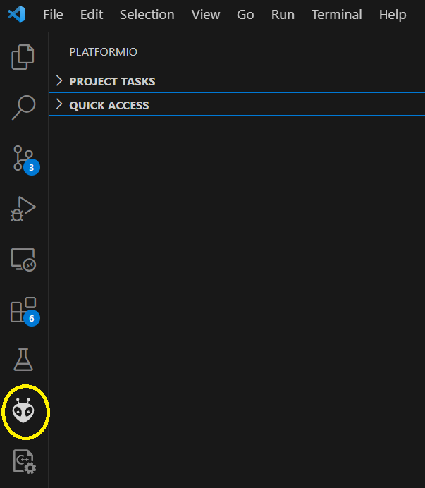
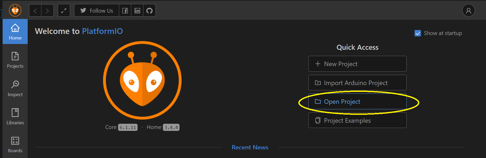
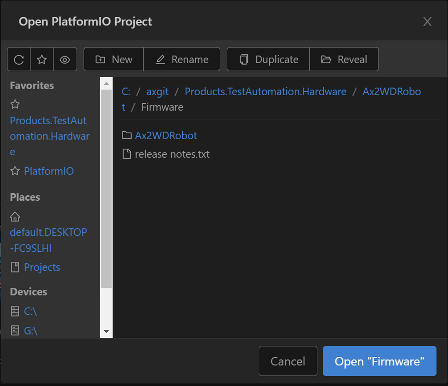
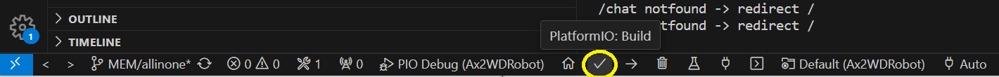
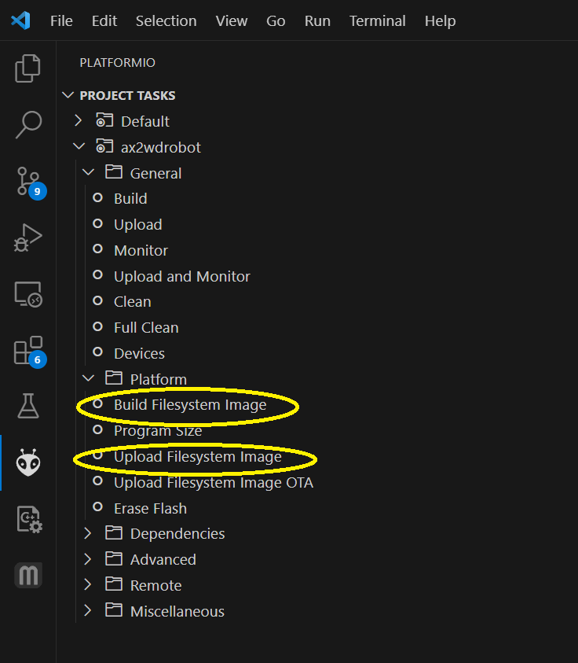

# Abrantix Ax2WDRobot Programming

## Overview

The Ax2WDRobot is based on espressif's ESP32. The provided firmware uses arduino-esp32 toolchain for unified Arduino-Style programming.
For firmware development, Visual Studio Code in conjunction with platformio extension are the recommended tools.

## IDE Installation

1. Navigate to https://code.visualstudio.com/download to download and install Visual Studio Code 
   
2. Start Visual Studio Code and open *Extensions*
   
   

3. In the Extensions screen, search for *platformio* and install it. After installation VS Code has to be restarted.

   

4. Now, you should have a platformio icon in the left toolbar - click on it

   

5. In the platformio Home menu, click on *Open project*

   

6. Navigate to the folder where you cloned the github project from and open *Ax2WDRobot/firmware/Ax2WDRobot* and click *Open Firmware*.
 
   

### Driver installation
The *Ax2WDRobot* uses a Silicon Labs CP210X USB to UART Bridge for communication between PC and robot. Depending on given OS, this driver is already built-in, could be provided as optional Update package or has to be manually installed. In case of a manual installation, please refer to https://www.silabs.com/developers/usb-to-uart-bridge-vcp-drivers?tab=downloads

## Build and upload the firmware
After opening the platformio project, the status bar got some additional icons.
To build, just press the *Check* icon

To upload, first connect the *Ax2WDRobot* to the PC and turn it on. Then, press the *right arrow* icon to build and upload the firmware.

## Build and upload the Filesystem Image
The firmware serves html files from an internal filesystem image which has to be initially loaded, too. This process has to be repeated in case of any change on given files in *data* folder.

1. Click on the platformio icon on the left toolbar
2. Under Project Tasks in the left window, expand *ax2wdrobot->Platform*
3. Execute *Build Filesystem Image*
4. If not already done, connect the *Ax2WDRobot* to the PC and turn it on.
5. Execute *Upload Filesystem Image*

For step 4, please ensure that no serial monitor windows are active - otherwise, the filesystem image upload will fail.
